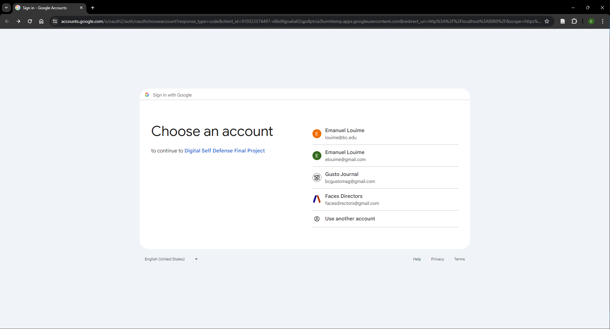
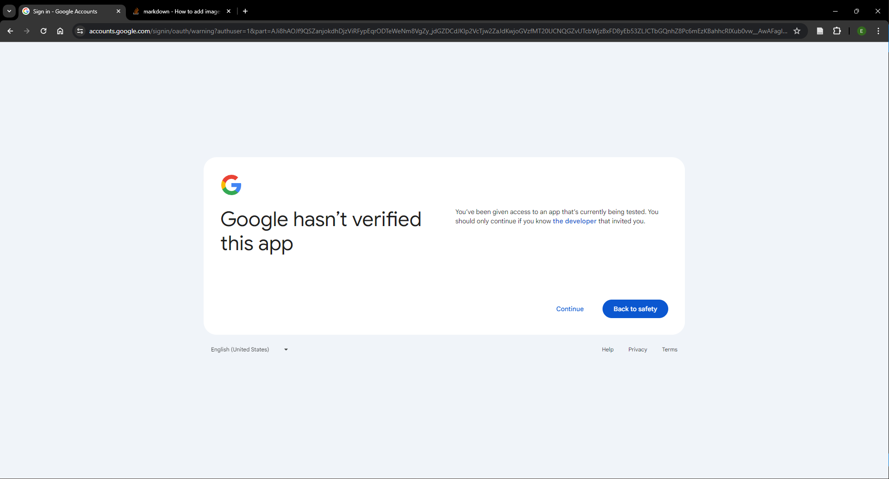
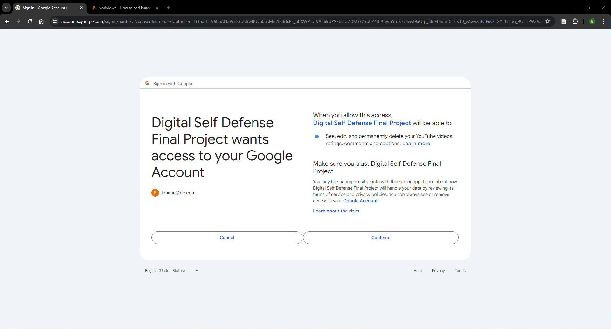
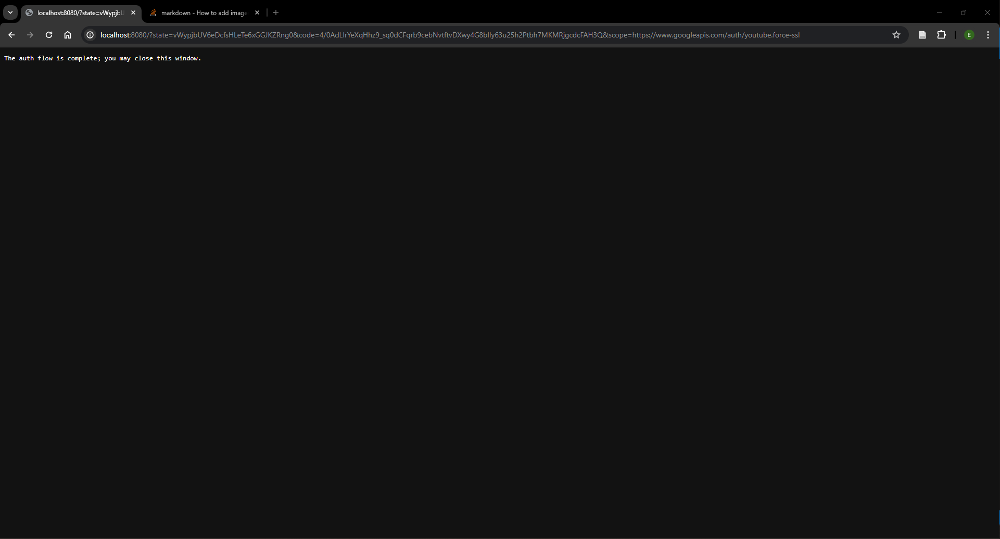
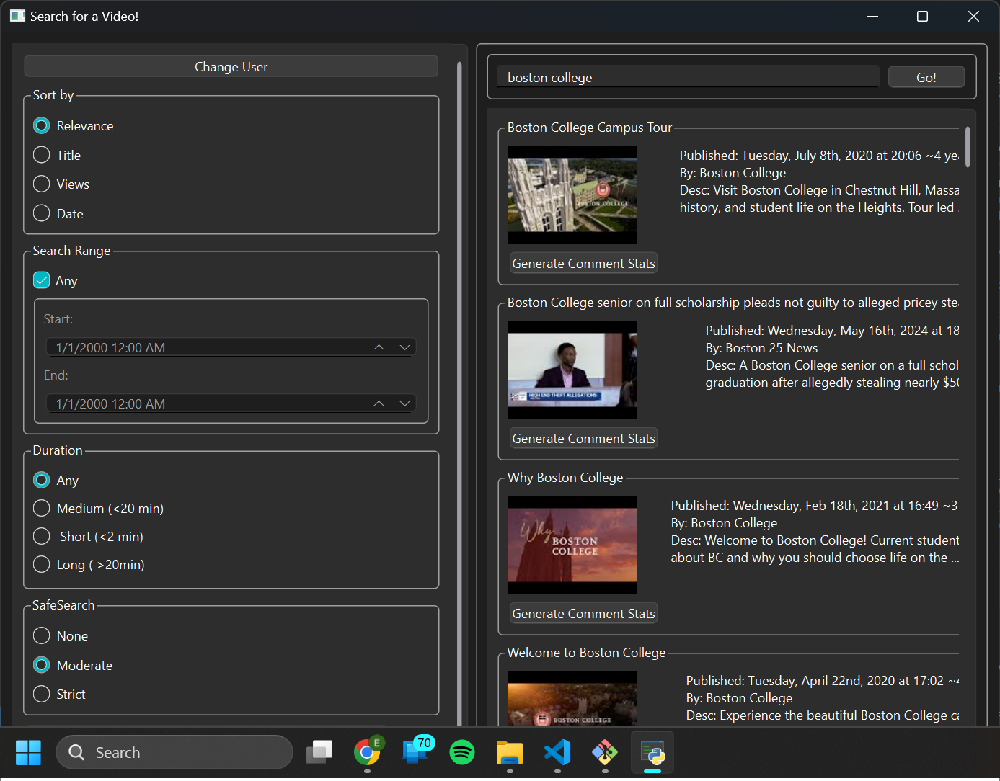
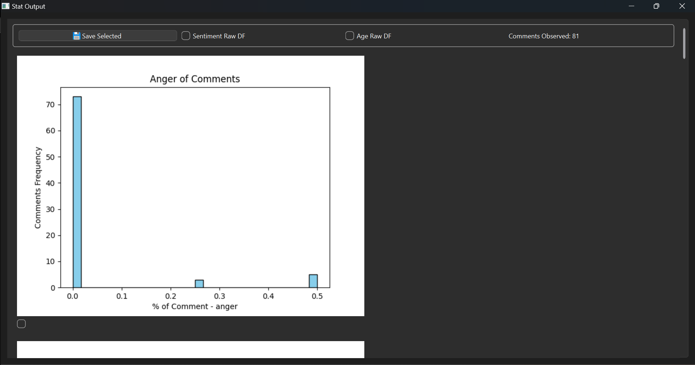
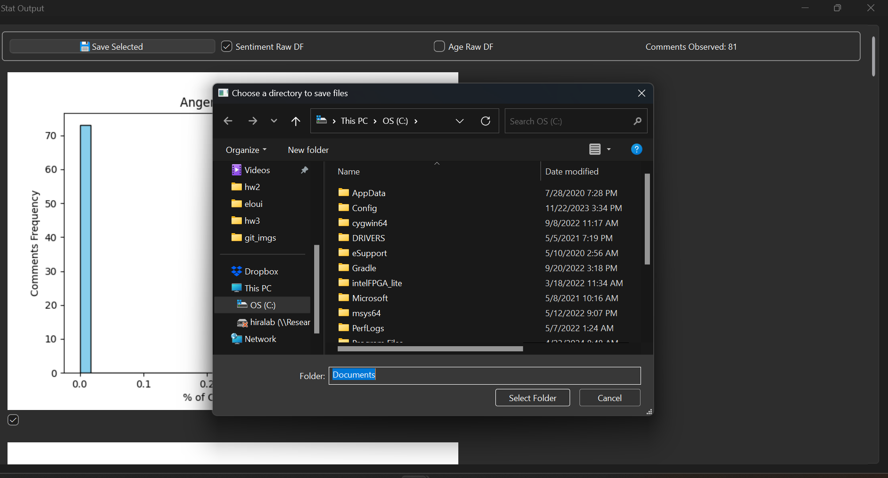

# Youtube Comment Sentiments Analysis App
Hello! This application is designed to provide analytics and a naieve sentiment analysis of YouTube comments of a specified video. 
Its main features include: 
- Per-Session authentication with OAuth2.0.
- Search with filters.
- Graphical output of sentiment analysis, comment age, user age.
- Select and save desired graphs or raw data.

## Rationale 
In the digital age it is easier than ever for normal individuals to have a voice and share their opinions, which means more so than ever, the voice of the masses can not only sway once seemingly unmoveable individuals or institutions, but it can often be a predictor or litmus test for change both at large and in insular communities. There is interesting information in the 'vibes' of the people that be obfuscated by individual biases or opinion, so a tool to quantify the sentiments of social media users in a categorical way could be useful.

**Potential applications include**: 
- Guaging public opinion on a topic or entity for: marketing, investing, shopping
- Determine if engagement may be spam or bots 

# Use 
## 1. In the browser window, give the application the necessary permissions.

## 2. Set desired search term and filters.

## 3. Generate stats for desired video.

## 3. Save desired stats to file.

